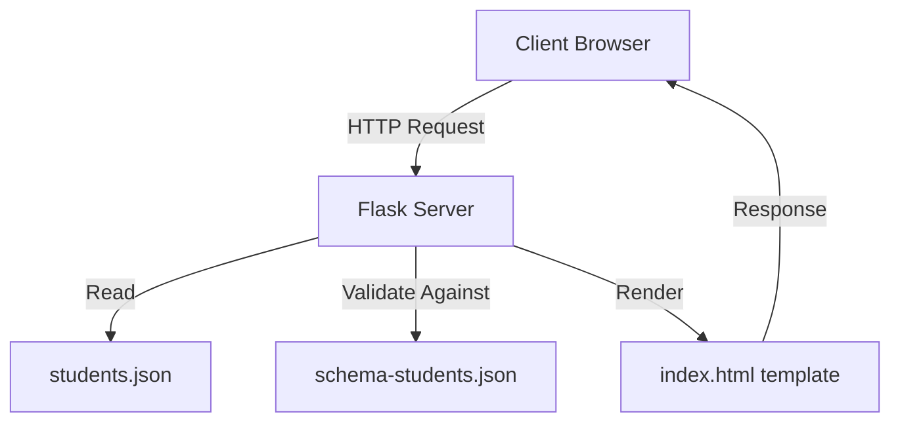
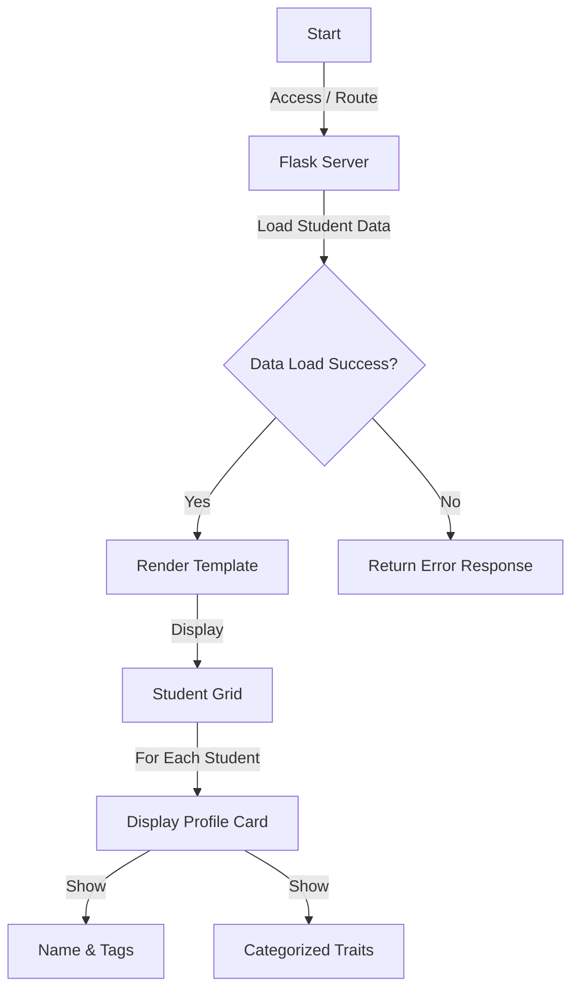
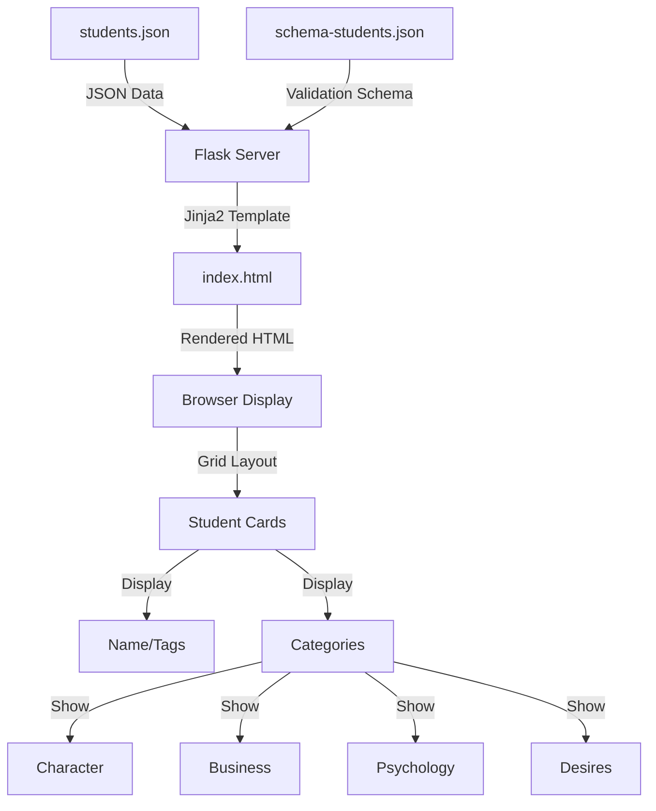

# Student Dialog Builder Documentation

## Project Overview
The Student Dialog Builder is a web application that manages and displays student profiles with rich metadata including actions (verbs), characteristics (adjectives), and categorized traits with emoji indicators. The system uses a Flask backend to serve student data through a responsive grid-based interface.

## System Architecture



## Key User Workflows



## Data Flow



## Setup Instructions

1. Prerequisites:
   - Python 3.x
   - Flask

2. Installation:
   ```bash
   pip install flask
   ```

3. Running the Application:
   ```bash
   python server.py
   ```

4. Access the application:
   - Open a browser and navigate to `http://localhost:5000`

## Project Structure
```
student-dialog-builder/
├── server.py              # Flask application server
├── schema-students.json   # JSON schema for data validation
├── students.json          # Student data
├── templates/
│   └── index.html        # HTML template for student grid
└── error.log             # Application error logs
```

## Error Handling
- All errors are logged to error.log
- Log format: `timestamp - name - level - message`
- Errors include stack traces and context
