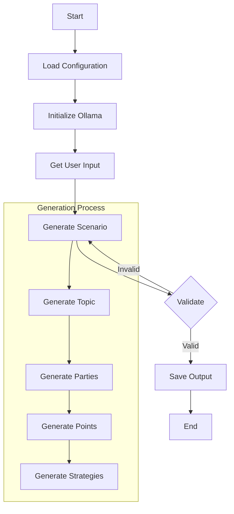
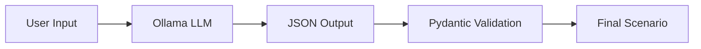
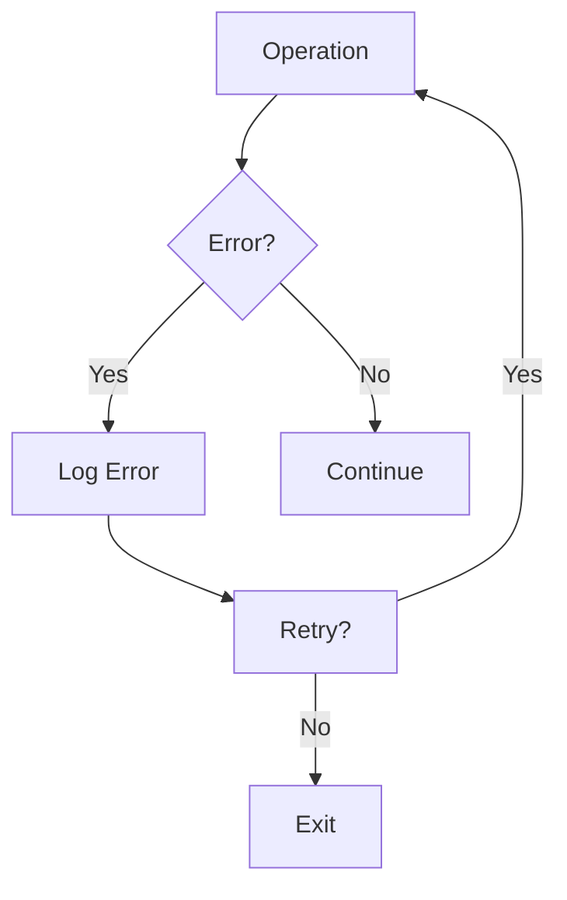

# Negotiation Generator Documentation

## System Overview

## Key Components

### Data Flow

### Error Handling

## Setup Instructions

1. Environment Setup
   - Python 3.8+
   - Ollama with llama3.2 model
   - Required Python packages

2. Configuration
   - Logging settings
   - Model parameters
   - Validation rules

3. Usage Guidelines
   - Command line interface
   - Input parameters
   - Output formats
