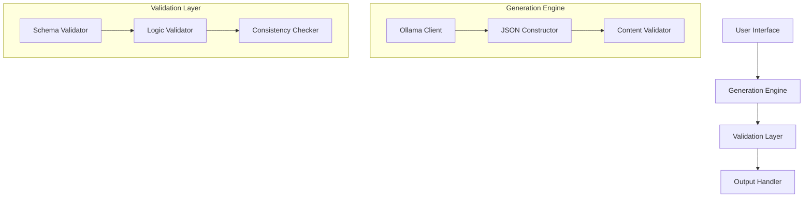

# System Patterns

## Architecture Overview

### Core Components

## Technical Decisions

### 1. Model Selection
- Using llama3.2 via Ollama
- Reasons:
  * Proven capability for structured output
  * Good performance with JSON generation
  * Consistent with existing system

### 2. Data Validation
- Pydantic for schema validation
- Benefits:
  * Type safety
  * Automatic validation
  * Clear error messages
  * JSON schema support

### 3. Error Handling
- Hierarchical error system
- Categories:
  * API Errors
  * Validation Errors
  * JSON Processing Errors
  * General Errors

### 4. Logging System
- Rotating file logs
- Structured logging format
- Separate error and general logs

## Design Patterns

### 1. Factory Pattern
- Used for scenario generation
- Separates creation logic
- Enables extensibility

### 2. Strategy Pattern
- Handles different generation approaches
- Allows for future expansion
- Maintains clean interfaces

### 3. Observer Pattern
- Monitors generation progress
- Handles logging events
- Manages error reporting

## Best Practices

### Code Organization
- Clear module structure
- Separation of concerns
- Consistent naming conventions

### Error Management
- Comprehensive error hierarchy
- Detailed error messages
- Proper error propagation

### Validation Strategy
- Multi-layer validation
- Early failure detection
- Clear feedback mechanisms

## Performance Considerations

### Optimization Points
- Caching mechanisms
- Batch processing
- Resource management

### Scalability
- Modular design
- Configurable components
- Resource efficient

## Testing Strategy

### Unit Tests
- Component isolation
- Error case coverage
- Boundary testing

### Integration Tests
- End-to-end workflows
- System interaction
- Performance metrics
